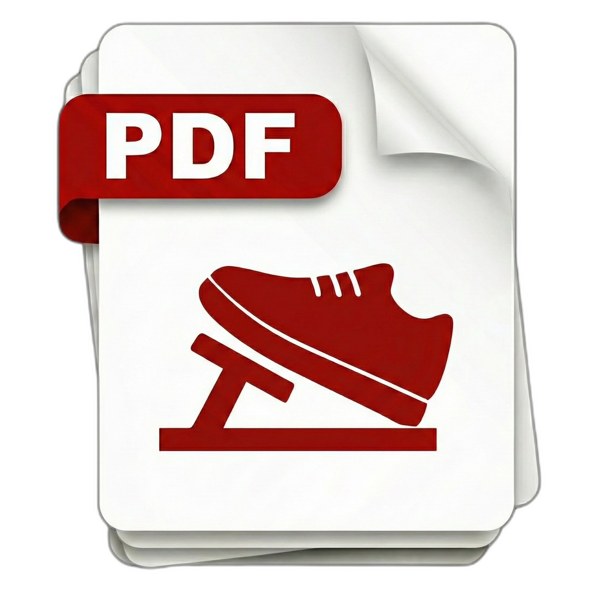

#  Pedaru

AI-enhanced PDF reader


## Features

### 📖 PDF Viewing
- **Single & Two-Column View**: Switch between single page and two-column (spread) view modes
- **Manual Zoom**: Zoom in/out with 25% increments (keyboard shortcuts or UI controls)
- **Smooth Navigation**: Navigate pages with keyboard arrows, page input, or scroll

### 🗂️ Tab Management
- **Multiple Tabs**: Open multiple pages in separate tabs
- **Tab Sync**: Tab page numbers update when navigating
- **Close Tabs**: Use Cmd+W (macOS) / Ctrl+W (Windows/Linux) to close current tab

### 🪟 Standalone Windows
- **Drag & Drop**: Drag a page to open it in a standalone window
- **Window Sync**: Standalone windows sync with main viewer page changes
- **Chapter Display**: Windows show current chapter from TOC
- **Window Sidebar**: Manage all open windows from sidebar

### 📑 Table of Contents
- **TOC Sidebar**: View and navigate document structure
- **Chapter Navigation**: Click TOC items to jump to sections

### 🔍 Search
- **Full-Text Search**: Search across all pages
- **Non-Blocking**: Search runs in background without freezing UI
- **Result Navigation**: Click results to open in new tabs
- **Highlight Matches**: Search terms highlighted in document

### 📜 Navigation History
- **Back/Forward**: Navigate through page history
- **History Sidebar**: View and jump to previous pages

### 🔗 PDF Links
- **Internal Links**: Click TOC/index links to navigate within document
- **External Links**: URLs open in system web browser

## Keyboard Shortcuts

| Action | macOS | Windows/Linux |
|--------|-------|---------------|
| Previous Page | `←` or `↑` | `←` or `↑` |
| Next Page | `→` or `↓` | `→` or `↓` |
| Zoom In | `Cmd + =` | `Ctrl + =` |
| Zoom Out | `Cmd + -` | `Ctrl + -` |
| Reset Zoom | `Cmd + 0` | `Ctrl + 0` |
| New Tab | `Cmd + T` | `Ctrl + T` |
| New Window | `Cmd + N` | `Ctrl + N` |
| Close Tab | `Cmd + W` | `Ctrl + W` |
| Toggle Bookmark | `Cmd + B` | `Ctrl + B` |
| Search | `Cmd + F` | `Ctrl + F` |

## Tech Stack

- **Frontend**: React, Next.js, TypeScript, Tailwind CSS
- **Desktop**: Tauri 2.x (Rust)
- **PDF Rendering**: react-pdf (PDF.js)

## Development

### Prerequisites

- Node.js >= 18.17.0
- Rust >= 1.85
- Tauri CLI

### Setup

```bash
# Install dependencies
npm install

# Run development server
npm run tauri dev

# Build for production
npm run tauri build
```

### Debugging

#### Testing PDF File Opening

To test opening a PDF file via command line (simulating double-click behavior):

```bash
# Use absolute path (relative paths won't work)
npm run tauri dev -- -- /absolute/path/to/file.pdf

# Example
npm run tauri dev -- -- /Users/username/Documents/sample.pdf
```

To test without opening a PDF (restores last opened file):

```bash
npm run tauri dev
```

#### Viewing Logs

**Development mode (`npm run tauri dev`):**
- Rust logs (`eprintln!`) appear in the terminal
- Frontend logs (`console.log`) appear in the WebView DevTools (right-click → Inspect Element)

**Production build:**

```bash
# Build with debug symbols
npm run tauri build -- --debug

# Run the app and view logs in Console.app (macOS)
# Filter by "Pedaru" to see app-specific logs
open /Applications/Utilities/Console.app
```

Or run the built app from terminal to see logs:

```bash
# After building
./src-tauri/target/release/bundle/macos/Pedaru.app/Contents/MacOS/Pedaru
```

#### Testing File Associations (macOS)

File associations only work with the built app:

```bash
# Build the app
npm run tauri build

# The app is created at:
# src-tauri/target/release/bundle/macos/Pedaru.app

# Test by:
# 1. Right-click a PDF in Finder → Open With → Pedaru
# 2. Or drag a PDF onto Pedaru.app icon
# 3. Or double-click a PDF after setting Pedaru as default PDF app
```

## License

MIT
