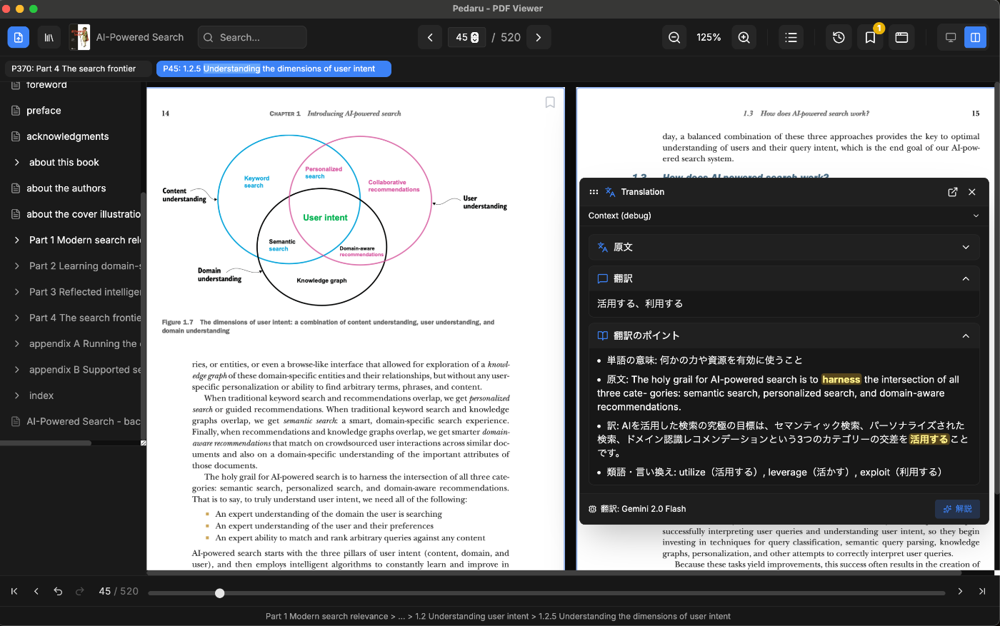

#  Pedaru

A cross-platform desktop PDF reader with Gemini translation




## Installation

### Download pre-built binary

Download pre-built binaries from [Releases page](https://github.com/togatoga/pedaru/releases).

- **macOS**: Download `.dmg` file
- **Linux**: Download `.deb` or `.AppImage` file
- **Windows**: Download `.msi` file

#### macOS: Opening unsigned apps

Pedaru is not signed with an Apple Developer certificate. When you try to open the app, macOS may show an error saying the app is "damaged" or "can't be opened".

To fix this, run the following command in Terminal before opening the `.dmg` file:

```bash
xattr -r -d com.apple.quarantine Pedaru_x.x.x_aarch64.dmg
```

This is a temporary measure until the app is properly signed.

### Build from source

**Prerequisites:**

- Node.js >= 18.17.0
- Rust >= 1.85
- Tauri CLI (`cargo install tauri-cli`)

```bash
git clone https://github.com/togatoga/pedaru.git
cd pedaru
npm install
npm run tauri build
```

Build outputs:

- **macOS**: `src-tauri/target/release/bundle/macos/Pedaru.app` and `.dmg`
- **Linux**: `src-tauri/target/release/bundle/deb/*.deb` and `appimage/*.AppImage`
- **Windows**: `src-tauri/target/release/bundle/msi/*.msi`

## Features

### 📖 PDF Viewing

- **Single & Two-Column View**: Switch between single page and two-column (spread) view modes with `Cmd+\` / `Ctrl+\`
- **Manual Zoom**: Zoom in/out with 25% increments (keyboard shortcuts or UI controls)
- **Smooth Navigation**: Navigate pages with keyboard arrows, page input, or scroll
- **Hide Header**: Toggle header visibility with `Cmd+Shift+H` / `Ctrl+Shift+H` for distraction-free reading

### 🗂️ Tab Management

- **Multiple Tabs**: Open multiple pages in separate tabs
- **Tab Navigation**: Switch between tabs with `Cmd+[` / `Cmd+]` (macOS) or `Ctrl+[` / `Ctrl+]` (Windows/Linux)
- **Tab Sync**: Tab page numbers update when navigating
- **Close Tabs**: Use `Cmd+W` (macOS) / `Ctrl+W` (Windows/Linux) to close current tab

### 🪟 Standalone Windows

- **Drag & Drop**: Drag a page to open it in a standalone window
- **New Window**: Open current page in standalone window with `Cmd+N` / `Ctrl+N`
- **Window Sync**: Standalone windows sync with main viewer page changes
- **Chapter Display**: Windows show current chapter from TOC
- **Window Sidebar**: Manage all open windows from sidebar

### 📑 Table of Contents

- **TOC Sidebar**: View and navigate document structure
- **Chapter Navigation**: Click TOC items to jump to sections

### 🔍 Search

- **Full-Text Search**: Search across all pages with `Cmd+F` / `Ctrl+F`
- **Non-Blocking**: Search runs in background without freezing UI
- **Result Navigation**: Use `↑`/`↓` to preview results, `Enter` to confirm
- **Highlight Matches**: Search terms highlighted in document

### 📜 Navigation History

- **Back/Forward**: Navigate through page history with `Ctrl+,` / `Ctrl+.`
- **History Sidebar**: View and jump to previous pages

### 🔗 PDF Links

- **Internal Links**: Click TOC/index links to navigate within document
- **External Links**: URLs open in system web browser

### 💾 Session Persistence

- **SQLite Database**: All session data stored in local SQLite database
- **Auto-Save**: Page position, zoom, bookmarks, tabs, and windows saved automatically
- **Cross-Session**: Resume exactly where you left off when reopening PDFs
- **Open Recent**: Quick access to recently opened PDFs from File → Open Recent menu

### 🔖 Bookmarks

- **Add Bookmarks**: Use `Cmd+B` (macOS) / `Ctrl+B` (Windows/Linux) to bookmark current page
- **Bookmark Sidebar**: View and manage all bookmarks
- **Cross-Window Sync**: Bookmarks sync across all windows

### 🌐 Gemini Translation

- **Text Translation**: Select text and press `Cmd+J` / `Ctrl+J` to translate
- **Auto-Explanation**: Use `Cmd+E` / `Ctrl+E` for translation with grammar explanations
- **Context-Aware**: Translation includes surrounding context for better accuracy
- **Draggable Popup**: Move translation popup anywhere on screen

### 📚 Google Drive Bookshelf

- **Cloud Sync**: Connect Google Drive folders to access your PDF library
- **Background Download**: PDFs download in background with progress tracking
- **Thumbnail Preview**: Visual bookshelf with document thumbnails

## Keyboard Shortcuts

### Navigation

| Action           | macOS             | Windows/Linux     |
| ---------------- | ----------------- | ----------------- |
| Previous Page    | `←` or `PageUp`   | `←` or `PageUp`   |
| Next Page        | `→` or `PageDown` | `→` or `PageDown` |
| First Page       | `Home`            | `Home`            |
| Last Page        | `End`             | `End`             |
| Navigate Back    | `Ctrl + ,`        | `Ctrl + ,`        |
| Navigate Forward | `Ctrl + .`        | `Ctrl + .`        |

### Zoom

| Action     | macOS     | Windows/Linux |
| ---------- | --------- | ------------- |
| Zoom In    | `Cmd + =` | `Ctrl + =`    |
| Zoom Out   | `Cmd + -` | `Ctrl + -`    |
| Reset Zoom | `Cmd + 0` | `Ctrl + 0`    |

### Tabs & Windows

| Action             | macOS       | Windows/Linux |
| ------------------ | ----------- | ------------- |
| New Tab            | `Cmd + T`   | `Ctrl + T`    |
| Close Tab          | `Cmd + W`   | `Ctrl + W`    |
| Previous Tab       | `Cmd + [`   | `Ctrl + [`    |
| Next Tab           | `Cmd + ]`   | `Ctrl + ]`    |
| Switch to Tab 1-8  | `Cmd + 1-8` | `Ctrl + 1-8`  |
| Switch to Last Tab | `Cmd + 9`   | `Ctrl + 9`    |
| New Window         | `Cmd + N`   | `Ctrl + N`    |

### View

| Action            | macOS             | Windows/Linux      |
| ----------------- | ----------------- | ------------------ |
| Toggle Two-Column | `Cmd + \`         | `Ctrl + \`         |
| Toggle Header     | `Cmd + Shift + H` | `Ctrl + Shift + H` |

### Tools

| Action                     | macOS     | Windows/Linux |
| -------------------------- | --------- | ------------- |
| Search                     | `Cmd + F` | `Ctrl + F`    |
| Toggle Bookmark            | `Cmd + B` | `Ctrl + B`    |
| Translate                  | `Cmd + J` | `Ctrl + J`    |
| Translate with Explanation | `Cmd + E` | `Ctrl + E`    |
| Select All Text            | `Cmd + A` | `Ctrl + A`    |

### Search (when active)

| Action                  | Key      |
| ----------------------- | -------- |
| Preview Previous Result | `↑`      |
| Preview Next Result     | `↓`      |
| Confirm Result          | `Enter`  |
| Clear Search            | `Escape` |

## Tech Stack

- **Frontend**: React, Next.js, TypeScript, Tailwind CSS
- **Desktop**: Tauri 2.x (Rust)
- **PDF Rendering**: react-pdf (PDF.js)
- **Database**: SQLite (via rusqlite)

## Contributing

Contributions are welcome! Please see [CONTRIBUTING.md](CONTRIBUTING.md) for guidelines.
